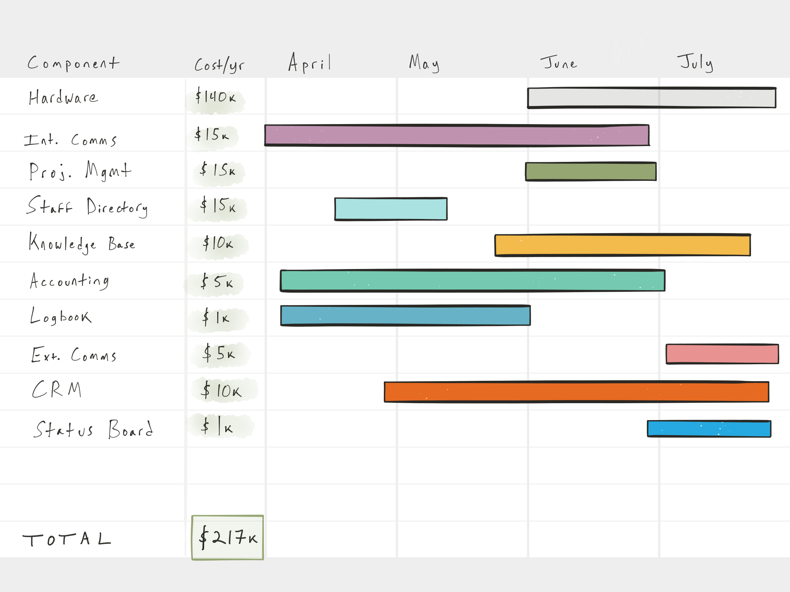

This document describes the necessary parts of our IT system, how they should fit together, and the plan for making it happen.

<figure>
  
  <figcaption>Components</figcaption>
</figure>

<figure>
  
  <figcaption>Information Flow</figcaption>
</figure>

<figure>
  
  <figcaption>Timeline & Budget</figcaption>
</figure>

Hardware
---------
Providing fast, networked hardware to the entire staff is what makes the rest of the system possible.

### Primary Users
- All Staff

### Benefits
- We can run software, which it turns out is impossible without computers.
- We can run *powerful* software, which is impossible without powerful computers.
- We can hire people who aren't wealthy enough to buy their own computers.
- We can give our work and home lives separate contexts.
- Fixing a bug for one person's device will fix it for everyone.

### Costs
- Device Leasing: $40k/yr
- IT Support: $60k/yr
- LTE Data: $40k/yr
- Total: $140,000 annual

### Setup Time
- 2 months

Internal Comms
--------------
We need a better-organized, more transparent system than email. It must also be wired to every other IT system, so we can search and control as many things as possible from one place.

### Primary users
- All staff

### Benefits
- Faster than email, less intrusive than texting
- See what other teams are discussing
- Interact with other systems just by asking questions
- Voice calls without using personal phone numbers (or personal phone minutes!)

### Costs
- Slack: $10k/yr
- Custom Slack integrations: $5k/yr
- Total: $15,000/yr

### Time
- 3 months

Staff Directory
---------------
We need a canonical list of who works for TFP, what they're like, and what (at a high level) they're working on.

### Primary users
- Staff, searching for people with particular skills
- Managers, checking employee portfolios before performance reviews
- Travel-booking team
- All other software that requires a list of employees

### Benefits
- We’ll all know who works here!
- The steps to add someone to the directory will *just be* the HR onboarding checklist.
- All relevant info for each employee lives in one place
- We only need to keep *one* list of employees, not a dozen.

### Costs
- $12k/yr

### Time
- 3 weeks

Project/Task Manager
--------------------
We need to organize people into projects and teams, assign work, and track progress publicly. Ideally, this system will also replace ask@thefutureproject.org with an actual support ticketing system, so you can make formal requests of people over whom you have no management authority.

### Primary users
- All staff, planning their work weeks
- Managers, assigning work to their direct reports
- Staff, requesting that someone else do a thing for them
- Anyone wondering "Is anyone working on that thing?"

### Benefits
- It turns out you need one of these to actually follow a plan
- We'll use the team's time and talent more strategically, less wastefully.
- For any strategic goals we set, we'll actually know how we're doing

### Costs
- Asana: $15k/yr

### Time
- 1 month

Knowledge Base
--------------
We need to keep track of what we know and how we work, in a place we can browse and search. Think Wikipedia meets Reddit.

### Primary users
- All staff, especially newer employees
- More seasoned staff, documenting best practices

### Benefits
- Knowledge will be available on-demand, instead of whenever we happen to decide to email it to people.
- Staff will find answers to questions they didn't even know they had.
- We'll find answers to most operational questions here, instead of interrupting someone on the Enterprise team.

### Costs
- $8k/yr

### Time
- 2 months

Accounting
----------
We need to track money coming and going, rigorously enough to satisfy the IRS, and intelligently enough to cut down on data entry.

### Primary users
- Finance team
- Executive team
- All staff, getting benefits and $$!

### Benefits
- Automated expense reporting
- Less time doing data entry, more time doing analysis
- Potentially cost-saving, if we can nix Expensify and ADP

### Costs
TODO: Ask Hayley!

### Time
- 3 months

Logbook
-------
We need to track our work with students, and use the data to make our work better.

### Primary users
- Dream Directors
- Chief Dream Directors
- Research Team

### Benefits
- Track impact over time
- Set data-driven performance goals
- Prompt qualitative and quantitative reflection on the work

### Costs
- Server: $1k/yr

### Time
- 2 months

Networked File Storage
---------------------------------
Sometimes, you just need to put some files in folders. This is Google Suite (Drive, Docs, Sheets, etc) -- but we should start thinking of it as a place for collaboration and temporary storage. It is NOT a publishing platform.

### Primary users
- All staff

### Benefits
- Access to personal files across multiple devices
- Shared files, etc
- Google Apps, pretty much

### Costs
- Google Apps: Free!

### Time
- 2 weeks (cleanup and organize what's already there)

External Comms
--------------
Gotta keep in touch with at least a few people who don't work at The Future Project, you know?

### Primary Users
- Marketing Team
- Fundraising Team
- Executive Team
- The rest of us too, I guess

### Benefits
- Spreading the good word
- Interacting with outside humans

### Costs
- Mailchimp: $2k/yr
- Phone/FIOS: $1k/yr
- Misc: $2k/yr
- Gmail: Free
- Total: $5k/yr

### Time
- 2 weeks

CRM
---
We need one place to track donors, volunteers, potential hires, and other people in the communities we engage.

### Primary Users
- Movement Team
- Fundraising
- Marketing
- Executive

### Benefits
- We'll know our communication history with everyone in our network. This means that Jill, for example, could pull up a donor file and know his/her history of communication with Andrew.
- We'll be able to make connections on behalf of our students.
- We'll be able to convert volunteers into employees or donors.

### Costs
Airtable: $10k/yr

### Setup Time
- 3 months

Status Board
------------
Every part of the IT system will send data to the Status Board, which will configure it into a personalized set of news, graphs, and stats for each employee.

### Primary users
- Leadership
- Chiefs & city admin staff

### Benefits
- At-a-glance transparency about what is happening where
- Realtime financial and progress dashboards
- Single place to find other parts of the system

### Costs
- Server: $1k/year

### Time
- 2 months

