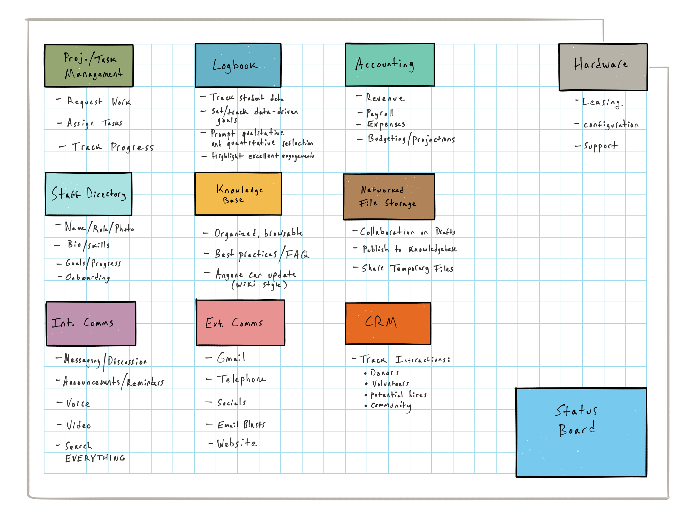
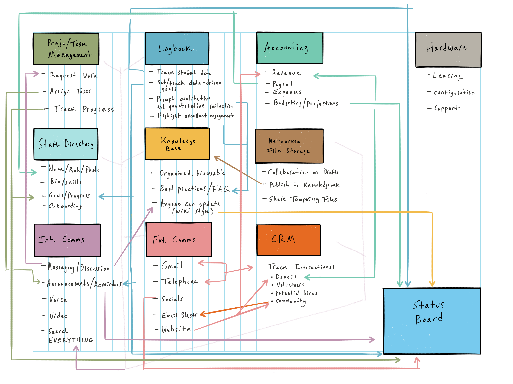

We're on a mission to strategically apply technology across The Future Project.
Our digital toolkit in years past has been haphazard and bad. Getting it right
for next year will require up to three new full-time hires and a lot of money,
so look out.

**Phase I** began in January, and was about mapping the IT needs of employees from
all over, including:

- **Dream Directors**
  - Sallome
  - Christian
  - Sarah Z
  - Kleaver
- **Ops**
  - Ali
  - Hayley
- **Learning**
  - Becca
  - Joseph
- **Finance & Fundraising**
  - Jill
  - Paul
- **Executive**
  - Zac
  - Sophia

**Phase II** began this month, and was about synthesizing what we'd learned into
a comprehensive set of components. These are described below.

**Phase III** begins today. It is about prioritizing the components of our IT
system and agreeing on how much we will spend to implement them. Your mission, if
you are reading this, is to study the system below in preparation for our first
Budget/Priorities meeting.

***

Components, Costs, and Personnel
--------------------------------

|Component              |Annual Cost      |Setup Time   |Ideal Team
|-----------------------|-----------------|-------------|----------
|Hardware               | $100,000        |2 months     |Chris, IT Technician (New Hire)
|Int. Comms             | $15,000         |3 months     |Chris, Sarah Z
|CRM                    | $10,000         |3 months     |Jill, Jeff, Chris
|Proj. Mgmt             | $15,000         |1 month      |Kanya, Chris, Sophia
|Staff Directory        | $15,000         |1 month      |Hayley, Sophia, Chris
|Knowledge Base         | $5,000          |2 months     |Sarah Z, Mica, Troy, Joseph, Chris
|Finance/Payroll        | $50,000         |3 months     |CFO, Sophia, Chris, Hayley
|Ext. Comms             | $69,000         |1 month      |Andrew, Sophia, Chris
|Status Board           | $1,000          |1 month      |Chris, Andrew, Kanya
|Logbook                | $1,000          |2 months     |Chris, New Hire, Joseph
|Hire Dev (for Logbook) | $100,000        |1 months     |Hayley, Chris, Kanya, Andrew
|Hire Data Manager      | $70,000         |1 month      |Hayley, Jill, Chris, Kanya, Andrew
|Hire IT Technician     | $70,000         |1 month      |Hayley, Chris, Kanya, Andrew
|**Total**              | **$521,000**    |**22 months**|

<figure>
  <figcaption>Component Map</figcaption>
  
</figure>

<figure>
  <figcaption>Information Flow</figcaption>
  
</figure>

Components in Detail
---------------------

### Hardware
Providing fast, networked hardware to the entire staff is what makes the rest of the system possible.

#### Primary Users
- All Staff

#### Benefits
- We can run software, which it turns out is impossible without computers.
- We can run *powerful* software, which is impossible without powerful computers.
- We can give our work and home lives separate contexts.
- We can hire people who aren't wealthy enough to buy their own computers.
- Fixing a bug for one person's device will fix it for everyone.

#### Costs
- Device Leasing: $40k/yr ($400/employee/yr)
- LTE Data: $40k/yr ($400/employee/yr)
- Office Buildout: $20k
- Total: $100k/yr (first year), $80k/yr (subsequent years)

#### Setup Time
- 2 months

### Internal Comms

We need a better-organized, more transparent system than email. It must also be wired to every other IT system, so we can search and control as many things as possible from one place.

#### Primary users
- All staff

#### Benefits
- Faster than email, less intrusive than texting
- See what other teams are discussing
- Interact with other systems just by asking questions
- Voice calls without using personal phone numbers (or personal phone minutes!)

#### Costs
- e.g. Slack: $10k/yr
- AI Bots for automated comms: $5k/yr
- Hangouts: $0
- Total: $15,000/yr

#### Time
- 3 months

### CRM
We need one place to track donors, volunteers, potential hires, and other people in the communities we engage.

#### Primary Users
- Movement Team
- Fundraising
- Marketing
- Executive

#### Benefits
- We'll know our communication history with everyone in our network. This means that Jill, for example, could pull up a donor file and know his/her history of communication with Andrew.
- We'll be able to make connections on behalf of our students.
- We'll be able to convert volunteers into employees or donors.

#### Costs
e.g. Airtable: $10k/yr

#### Setup Time
- 3 months

### Staff Directory
We need a directory of who works at TFP, what they're like, and what (at a high level) they're working on.

#### Primary users
- Staff, searching for people with particular skills
- Managers, checking employee portfolios before performance reviews
- Travel-booking team
- All other software that requires a list of employees
- HR, onboarding new employees

#### Benefits
- We’ll all know who works here!
- The steps to add someone to the directory will *just be* the HR onboarding checklist.
- All relevant info for each employee lives in one place
- We only need to keep *one* list of employees, not a dozen.

#### Costs
- $15k/yr

#### Time
- 3 weeks

### Project/Task Manager
We need to organize people into projects and teams, assign work, and track progress publicly. Ideally, this system will also replace ask@thefutureproject.org with an actual support ticketing system, so you can make formal requests of people over whom you have no management authority.

#### Primary users
- All staff, planning their work weeks
- All staff, looking for more transparency re: what TFP is up to
- Managers, assigning work to their direct reports
- Staff, requesting that someone else do a thing for them
- Anyone wondering "Is anyone working on that thing?"

#### Benefits
- It turns out you need one of these to actually follow a plan
- We'll use the team's time and talent more strategically, less wastefully.
- For any strategic goals we set, we'll actually know how we're doing

#### Costs
- e.g Asana: $15k/yr

#### Time
- 1 month

### Knowledge Base
We need to keep track of what we know and how we work, in a place we can browse
and search. Think Wikipedia meets Quora.

#### Primary users
- All staff, especially newer employees
- More seasoned staff, documenting best practices
- Employees being trained

#### Benefits
- Knowledge will be available on-demand, instead of whenever we happen to decide to email it to people.
- Staff will find answers to questions they didn't even know they had.
- We'll find answers to most operational questions here, instead of interrupting someone on the Enterprise team.
- We can replace some in-person trainings with digital systems.

#### Costs
- e.g. Kifi $8k/yr

#### Time
- 2 months

### Finance/Payroll
We need to track money coming and going, rigorously enough to satisfy the IRS,
and intelligently enough to cut down on data entry.

It's worth noting that our current tools work pretty well for us here, and the
main value we can add is to make them talk to each other more efficiently, so we
spend less time preparing budgets, expense reports, and visualizations by hand.
We want to free the humans on our finance team to spend more time planning and
analyzing.

#### Primary users
- Finance team
- Executive team
- All staff, getting benefits and $$!

#### Benefits
- Automated expense reporting
- Less time doing data entry, more time doing analysis

#### Costs
- $50k/yr ??
- How much does Namely cost?

#### Time
- 3 months

### Logbook
We need to track our work with students, and use the data to make our work better.
One thing we've learned this year is that developing and maintaining
consumer-grade proprietary software is a full-time job. So unless we replace
Logbook with an off-the-shelf solution, we need to hire a second Developer on
our team.

#### Primary users
- Dream Directors
- Chief Dream Directors
- Research Team

#### Benefits
- Track impact over time
- Set data-driven performance goals
- Prompt qualitative and quantitative reflection on the work

#### Costs
- Server: $1k/yr
- New Hire!!

#### Time
- 2 months

### Networked File Storage
Sometimes, you just need to put some files in folders. This is Google Suite (Drive, Docs, Sheets, etc) -- but we should start thinking of it as a place for collaboration and temporary storage. It is NOT a publishing platform.

#### Primary users
- All staff

#### Benefits
- Access to personal files across multiple devices
- Shared files, etc
- Google Apps, pretty much

#### Costs
- Google Apps: Free!

#### Time
- 2 weeks (cleanup and organize what's already there)

### External Comms
Gotta keep in touch with at least a few people who don't work at The Future Project, you know?

#### Primary Users
- Marketing Team
- Fundraising Team
- Executive Team
- The rest of us too, I guess

#### Benefits
- Spreading the good word
- Interacting with outside humans

#### Costs
- e.g. Mailchimp: $2k/yr
- Phone/FIOS: $1k/yr
- Misc: $2k/yr
- e.g. BlueJeans (videoconferencing): $60k/yr
- Ruby Receptionist: $3,120/yr
- Gmail: Free
- Total: $69k/yr

#### Time
- 1 month

### Status Board
Every part of the IT system will send data to the Status Board, which will configure it into a personalized set of news, graphs, and stats for each employee.

#### Primary users
- Leadership
- Chiefs & city admin staff

#### Benefits
- At-a-glance transparency about what is happening where
- Realtime financial and progress dashboards
- Single place to find other parts of the system

#### Costs
- Server: $1k/year

#### Time
- 2 months

****

## User Summary - (Who Uses What?)

|                       |Executive    |Fundraising    |Field    |Learning   |Operations   |Movement
|-----------------------|-------------|---------------|---------|-----------|-------------|--------
|Hardware               |√            |√              |√        |√          |√            |√
|Int. Comms             |√            |√              |√        |√          |√            |√
|CRM                    |√            |√              |√        |           |             |√
|Proj. Mgmt             |√            |√              |√        |√          |√            |√
|Staff Directory        |√            |√              |√        |√          |√            |√
|Knowledge Base         |√            |√              |√        |√          |√            |√
|Finance/Payroll        |             |               |         |           |√            | 
|Ext. Comms             |√            |√              |√        |√          |√            |√
|Status Board           |√            |√              |√        |√          |√            |√
|Logbook                |             |√              |√        |√          |             | 

